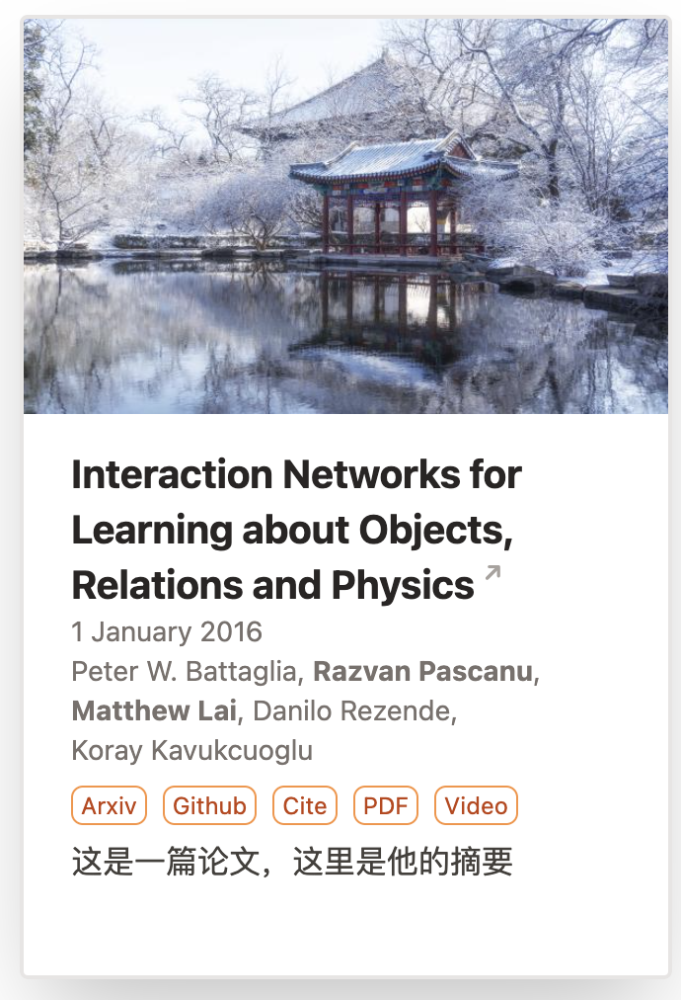
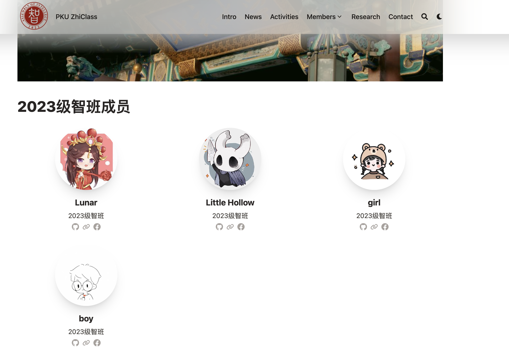
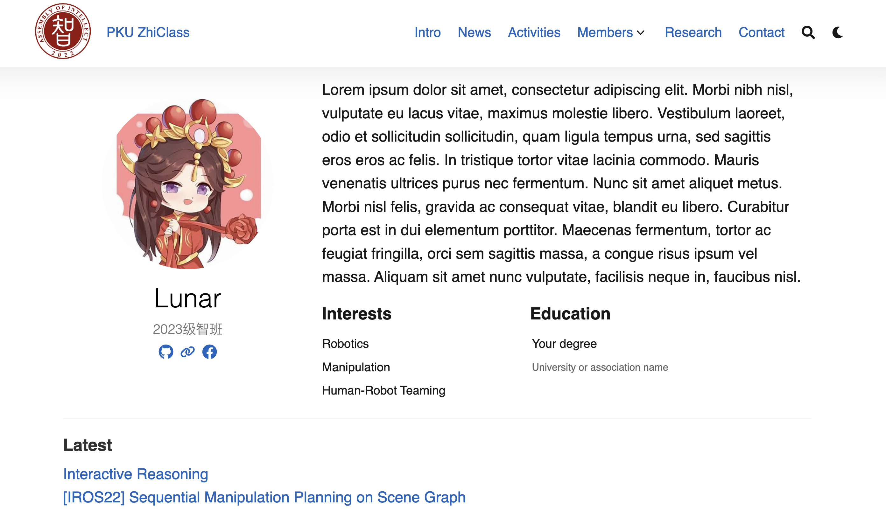

# Update Log
- 8月9日
    - research模块和activity模块基本搭建完成（可能存在一些小bug但是不影响使用）。我在```./content/research/example```、```./content/activities/example```以及```./content/activities/example_2```中放了三个例子。展示了如何使用这两个模块。**请注意，research模块的配置参数经过特殊设计，请严格按照例子中的格式进行配置。**
    - 我按照我的需求调整了config中的一些参数，确保网页在```layout = "background"```模式以及```showCard=false```的情况下可以正常运行（当然其他参数可能也改了，我只写出我记得比较重要的两个）。
    - homepage的显示方式进行了调整，大家可以运行查看，主要改了```_index.md```的渲染方式，把标题居左并调整了宽度，我觉得这样比较美观。同时homepage的文章卡片是使用[shortcode](https://blowfish.page/zh-cn/docs/shortcodes/)的方式实现的，可以参考```_index.md```中的写法。
        - 请参考```./layouts\partials\article-link\simple.html```
    - 现在的research文章实现了以下的功能
        - 点标题跳arxiv
        - 点标签（arxiv, github...）跳相应网站
        - 点Cite标签跳转cite.bib
        - 作者名字加粗
        - 显示摘要
        - 请参考```./layouts\partials\article-meta\basic.html```以及```./layouts\partials\home\background.html```
    - activity的文章基本上是用blowfish的内置功能实现的，该有的都有了
    - 我按照[这篇文章](https://blowfish.page/zh-cn/docs/advanced-customisation/)的方法修改了源码（**请不要直接更改源码！！**），更改的文件放在：
        - ```./layouts\partials\article-link\simple.html```
        - ```./layouts\partials\article-meta\basic.html```
        - ```./layouts\partials\home\background.html```
    - 有任何问题请联系林宇辰
- 8月10日
    - 增加 modal 弹窗功能，js脚本位于 ```./layouts\partials\article-meta\basic.html```中，目前暂时用于文章CiteTag的bibtex的显示、下载，如有其他地方需要可复用。
    
- 8月12日
    
    **整合了之前的代码，大致完成了members list页面、点进去之后每个人的具体页面的框架搭建，同时进行了一些全局params的修改。**具体如下：
    
    1. 将`params.toml`中[list]下的 `cardView` 从 false 改为 true. 
       - 如果是false，则在渲染list（比如members/2023 页面上每个人的缩略展示框）时不会调用 `partials/article-link/card.html`，而是采用如下的默认样式：
    
    

​		而原生的cardView呈现论文不美观，样式如下：



​		由于呈现members需要定制化cardView，故不得不启用cardView = true. 因此对于**Research板块**的**替代方法**是在 `./Research/_index.md` 的front matter中添加 `cardView: false`。即采用override机制。

> [!WARNING]
>
> 请注意front matter的两种写法：一种是以"---"包围，则应写成 `cardView: false`；一种是以"+++"包围，则应写成 `cardView = false`. 


2. 在members和具体的2021, 2022, 2023的页面，为了在这些页面不显示日期（blowfish会默认将articles按照date排序和分类，如果 `index.md` 中没有date属性，默认年份为 0001 ），在每个文件夹下的 `_index.md` 中添加 `groupByYear: false` 属性。


3. 将members的展示形式做成了圆形icon的card。效果如图：



（~~这4个头像成分复杂🤣~~） 可以看到是1行3个的grid。这部分代码是修改了 `layouts/partials/article-link/card.html`, 在每个member具体的markdown文件中添加了 `isMember: true` 的属性，从而在partials的代码中特判。同时在所有代码采用的main.css中添加了 `class = thumbnail_circle` 的样式（就是这个圆圆的icon）。

> [!TIP]
>
> 实际上并没有直接修改 `main.css` ，而是利用override机制添加了 `asset/css/custom.css` 文件并单独补充 `thumbnail_circle` 类。


4. 每个人的具体页面的css设计。这部分完全照抄[Hugo Academic CV Theme (academic-demo.netlify.app)](https://academic-demo.netlify.app/)和[Yida Niu | PKU CoRe Lab](https://pku.ai/author/yida-niu/)。通过将网页的html借助GPT改写为template，并复制相应的css文件（放在了`asset/css/wowchemy.css`）。渲染article的除header、footer以外部分的代码是 `layouts/_default/single.html`，通过 `isMember`属性特判，将个人简历的代码单独渲染。

   具体而言，单独写了一个 `layouts/partial/members/basic.html` 文件作为template，并导入到修改过的 `single.html` 中。

​	为了在最后展示大家的论文，单独在原来模板的末尾添加了 **latest** 板块，论文也将通过 front matter 的方式导入 title 和 url.

​	效果如下：



> [!NOTE]
>
> 有个bug是导入css的时候会让header和footer的字体变成**蓝色**（如上图），目前不清楚如何解决。

之后收材料的时候，每个人的markdown文件按如下样例写：

```markdown
---
name: "Lunar"
isMember: true
image: "./featured.jpeg"
memberType: "2023级智班"
bio: "Lorem ipsum dolor sit amet ..."

links: [
    { github: "https://github.com/NiuYida"},
    { link: "https://link-to-some-website.com/" },
    { facebook: "https://facebook.com/username" }
]
interests:
    - Robotics
    - Manipulation 
    - Human-Robot Teaming
education:
  - degree: "Your degree"
    institution: "University or association name"

publications:
  - title: "Interactive Reasoning"
    url: "/themes/interactive/"
  - title: "[IROS22] Sequential Manipulation Planning on Scene Graph"
    url: "/publication/vkc-planning2022iros/"
---
```

从这个文件可以看出，目前**没有**用taxonomy来标定authors和所作文章。


有问题随时联系于旻扬、赵瑞捷。

修改源码的方式仍然沿用[这篇文章](https://blowfish.page/zh-cn/docs/advanced-customisation/)，后续修改的同学请注意，你想要修改的文件是否之前已被修改过。

# TODO

- ~~修复显示cite.bib的问题~~ 已修复
- 我们不需要fork，可以换一下submodule的源
- 写一个从bib到research index.md的python脚本

